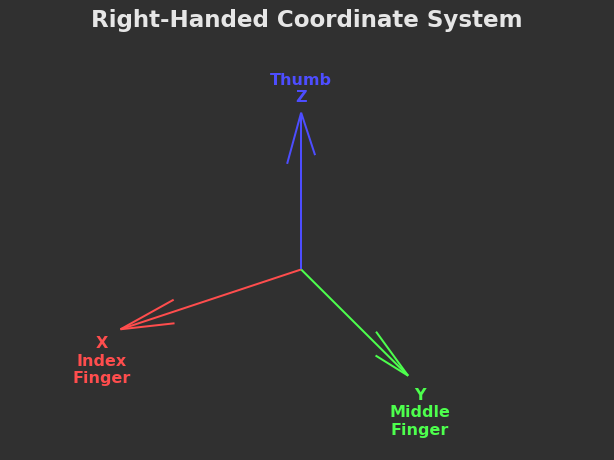
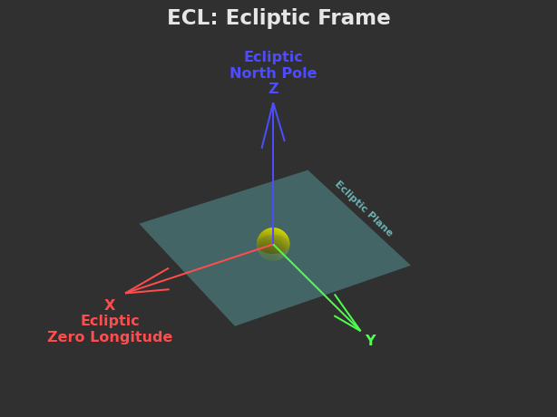
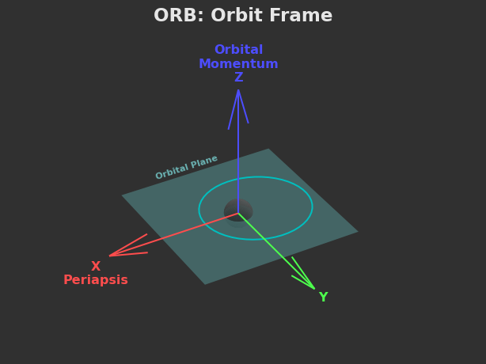
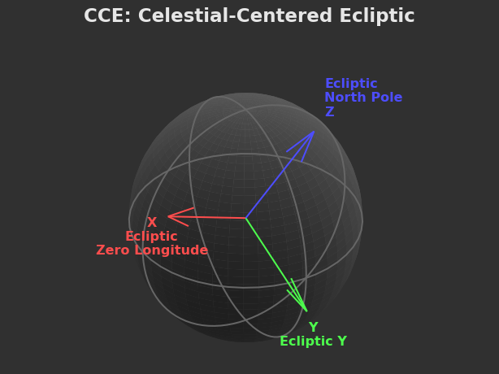
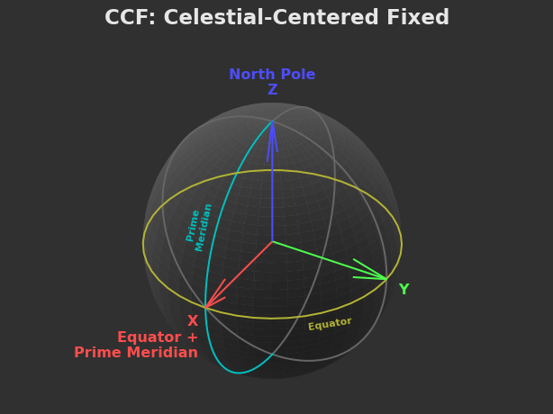
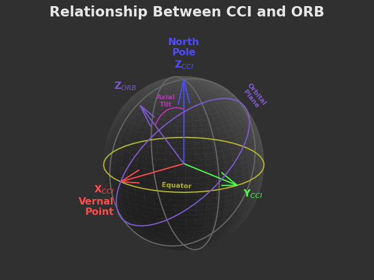

Celestial Coordinate Frames in KSA​
One of the many things that makes space flight confusing is losing the "up" direction. This is true for astronauts on EVA, but can be even worse for those trying to do the math on the ground.

Quantities like roll, pitch, and yaw, the orbital elements, and numerous others all take the form of vectors and rotations. These quantities are all with respect to some starting point. We call those starting points reference frames or coordinate frames, and they are vital for those who want to make sense of Kitten Space Agency's data at a deep level.

In this article, I want to share several of the most important coordinate frames used in KSA. I intend this to be a resource both for modders trying to understand KSA's data, as well as players who want a deeper understanding of how scientists and engineers think about physical and mathematical space.

In the Beginning, There Were the Axes​
For most spatial coordinate systems, you must start with an orthonormal basis. This is just a fancy way of saying "three direction vectors that are are mutually perpendicular".

All KSA coordinate frames are right-handed. There is no other convention. At no point in the game's history was it ever different. I won the war, so I get to write the history.

The right-hand rule is a convenient way to remember which vectors go where. I've labeled the appropriate right-handed fingers on the figure below.

One Frame To Bind Them​
In the course of this article, we will discuss several coordinate frames - but all of these frames must ultimately refer back to a single starting point. A root frame, to which all the other frames must answer.

A Brief Trip to Earth​

On Earth, we did the least imaginative thing possible and used the Earth itself as the basic reference frame. This frame is represented by the celestial sphere, which is roughly aligned with the north pole. Don't ask about the other axes, we'll get to those later.

As a coordinate system, the celestial sphere is more precisely called the equatorial coordinate system, as the equator is the plane which is defined by the north pole. We also noticed that the Sun was pretty important, so the circle traced out by the Sun in the sky got a special name: the ecliptic. In 3D, the ecliptic is simply the plane of Earth's orbit around the Sun. The ecliptic coordinate system, which references this plane, is the closest thing we have to a "universal" frame for our solar system that anyone actually uses on Earth.

Where Kittens Rule​

For KSA's solar system (and to handle modded solar systems from our lovely community), we need a slightly less parochial definition of the solar system root frame. In fact - since we are building the solar system from the outside rather than discovering it from the inside, we can reverse the entire problem and define the frame before there are any objects at all, freeing us from this old Earth convention.

ECL: Ecliptic Frame​
Just kidding, we called it exactly the same thing. In KSA, the root frame is ECL (Ecliptic Frame). It still serves as the universal solar system frame, but it's defined differently than its real-world counterpart. The frame is centered on the star, but its orientation is axiomatic in that we simply declare it to exist.

The Z axis takes on special significance as we declare it to define the "ecliptic plane", the plane on which any zero-inclination orbiting body will live. We then declare the X axis to be the point of zero longitude. This means that a body orbiting the star with zero inclination, zero longitude of ascending node, and zero argument of periapsis will have its periapsis point lie directly on the ECL X axis.

(the Y axis is also present)

Inertia​
ECL is an inertial frame. This is an extremely important concept in reference frames so it warrants a small diversion.

An inertial frame is one that doesn't rotate or accelerate. The reason this matters is because basic Newtonian mechanics are defined with respect to an inertial reference frame. If your reference frames starts rotating or accelerating, your objects will develop fictitious forces, which seem to "push" objects around even though no forces appear to be acting on them. While we can model fictitious forces, things get a lot simpler if we can avoid them. Things like orbits, which are bad enough without trying to use a non-inertial reference frame.

ORB: Orbit Frame​
Speaking of orbits, that brings us to our next frame. As I mentioned above, any object orbiting the star with zero inclination, longitude of ascending node, and argument of periapsis will lie in the ecliptic plane and have its periapsis point on the ecliptic X axis. In that case, the ecliptic frame and the orbiting body's ORB (Orbit Frame) would be exactly aligned.

If any of the aforementioned orbital elements are non-zero, then the orbit frame (also called the perifocal frame) will be rotated. I'm not drawing that one, though. I refer you to the Wikipedia diagram.

The ORB frame is also an inertial frame.

A Planet Without Form And Void​
Now that we we have an orbit, we need to put a planet on it.

Planet-centered coordinate systems are some of the most prevalent in KSA because we spend so much time around them. These are the CC* (Celestial-Centered) frames, which we will cover in sequence.

CCE: Celestial-Centered Ecliptic Frame​
The laziest of the possible options is to just use the ECL frame again, but re-center it on to the planet.

As you can see in the figure, the resulting axes don't really have anything to do with the features of the planet, but they do match the ECL frame exactly, which means that CCE (Celestial-Centered Ecliptic) is a valuable frame for comparing orientations of distant objects or other situations where a common frame of reference is needed. A notable example is vehicle orientation (which aerospace people call attitude), which is internally always kept in this frame.

CCE is also, you guessed it, an inertial frame.

In the KSA UI, this frame appears as STAR. In the real solar system, the ecliptic coordinate system is analogous to "CCE of Earth".

CCF: Celestial-Centered Fixed Frame​
If we actually care about the planet and not just its relation to the almighty ECL, we will want to take some of its physical properties into account.

The most obvious thing we might want to know is the coordinates of something on its surface. Like our launch site, or maybe somewhere underground where none of these reference frames matter. For that job, CCF (Celestial-Centered Fixed) is tied to the planet surface and remains there no matter how much it rotates.

In CCF, the Z axis points to the north pole (also known as the axis of rotation), while the X axis points to the intersection of the equator and the prime meridian. The equator is the plane that cuts the planet in half perpendicular to the north pole, while the prime meridian is the line where "zero longitude" is defined. On Earth, that runs through Greenwich, England. On the Moon, it's the direction that faces the Earth on average. In KSA, it's whatever the author decides!

Is CCF an inertial frame?

It is not! Unless you live on a planet that doesn't rotate, I suppose. But at least on Earth, we experience centrifugal and Coriolis forces, which are decidedly non-inertial. Fun fact: centrifugal force is the reason why planets aren't spheres, but rather oblate spheroids. If your rotating planet is spherical, then you will be very gently pushed towards the equator by the centrifugal force not aligning with the ground properly.

On Earth, this frame is known as ECEF (Earth-Centered, Earth-Fixed).

CCI: Celestial-Centered Inertial Frame​
The last but possibly most important of the CC* frames is CCI (Celestial-Centered Inertial). This is the equivalent of CCF, but for objects in orbit.

The orbital elements are typically defined in terms of the parent body's orientation. CCF gives us the equatorial plane which helps us define inclination, but we can't pin down the longitude of ascending node because the planet keeps spinning and changing which direction the point of zero longitude is!

Thus CCI proposes a bold solution to a complex problem - what if we just pretended the planet didn't spin? This means we preserve the CCF Z axis, but point the X axis in a fixed direction.

So what direction do we choose for the X axis? In theory we could choose any direction along the equatorial plane. In practice, we choose something called the vernal point, which is a fancy way of saying "spring equinox for the Northern hemisphere", which probably tells you nothing about what direction this vector is supposed to point.

The more intuitive way to understand the vernal point is that it's the intersection of the planet's equatorial plane and its orbital plane. In the figure below, you can see how a planet's axial tilt is also directly related to the vernal point.

Note that there are two possible directions to choose for X given the line of intersection of the equator and orbit plane. The vernal point is the one pictured above where the CCI Y axis is below the orbital plane (away from ORB Z).

With the vernal point established, we can now see how CCF and CCI are related through the "hour angle", which is the planet's rotation speed multiplied by how long it's been since the prime meridian crossed the vernal point.

No points for guessing whether CCI is inertial or not.

On Earth, this frame is known as ECI (Earth-Centered Inertial). Technically there are many ECI frames depending on where the X axis points. The equatorial coordinate system is a more specific form of ECI where the X axis points at Earth's spring equinox. That also changes with time, so an even more specific form of ECI is J2000.

Finally, It's Over​
I hope you have enjoyed this brief tour through the world of astrodynamical coordinate frames. There are (unfortunately) many more coordinate frames to consider once flying vehicles enter the equation - but we'll leave that for a later time!