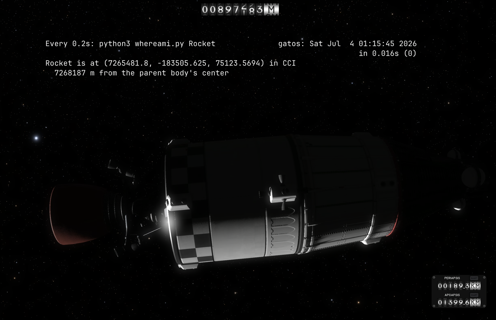

import { FileTree, Steps, Aside, LinkCard } from "@astrojs/starlight/components";

Every program you write in gatOS starts the same way: open a file under `/sim`, read a value, maybe
write one back. That's the whole API. There's no SDK to install, no client to configure — the
_live simulation is just a filesystem_, and file I/O is your spacecraft's control panel.

The catch is that "open a file, split the text into numbers" gets old fast when you copy-paste it into
every script. So before we fly anything, we're going to spend ten minutes building a tiny reusable **toolkit**.

Two little Python files full of the boring-but-essential plumbing. Do it once here, and every tutorial
after this gets to skip straight to the fun part.

## Before you start

<Steps>

1. **Install Python in gatOS** if you haven't already, run this from a gatOS shell:
    ```sh title="Install Python"
    apk add python3
    ```
2. **A rough feel for CCI.** We'll read a position in the CCI frame at the end of this tutorial.
    
    If "CCI" makes you squint, take five minutes with [Reference Frames](/gatOS/guides/reference-frames/) first — it's the
    gentle, no-math version. You don't _need_ it to follow along, but it'll help the payoff land.

</Steps>

## Why a toolkit, and not one giant script

You could absolutely cram everything into a single file every time and never look back — plenty of
people do. But the programs in this series build on each other, and they _all_ need the same two
things:

- a way to **talk to `/sim`**: read a value, write a value to a control — without fussing over text
  parsing every time.
- a bit of **vector and quaternion math**: the stuff that turns "point over there" into numbers the
  flight computer understands.

So we'll split those into two files you'll `import` everywhere: `gatos_io.py` and `gatos_frames.py`.

<Aside type="note" title="Focused for use in terminals">
  These are gatOS focused scripts, which I expect you'll likely be writing and running them in a terminal
  in-game, probably in `nvim` (because who uses Emacs, vim 4 life!)
  
  Anyways, so, the code will be intentionally terse: short single-line comments, no sprawling docstrings.
  We'll keep the deeper explanations here on the doc site, where you've got room to read it. 
  
  The code just does the thing.
</Aside>

## Setting up our workspace

Keep everything for this series in one directory so the imports "just work" — Python looks for
imported modules right next to the script that's running. We'll use `~/tutorials`:

<FileTree>

- ~/
  - tutorials/
    - gatos_io.py       read & write `/sim`
    - gatos_frames.py   vectors + the Body→CCI quaternion
    - whereami.py       our first tiny program
    - ...               (every later tutorial's program lands here too)

</FileTree>

Make the dir and hop in:

```sh title="Setup tutorials dir"
mkdir -p ~/tutorials && cd ~/tutorials
```

## File 1: `gatos_io.py`, talking to the /sim filesystem

Here's the whole file, put it in `~/tutorials/gatos_io.py`:

```python title="~/tutorials/gatos_io.py"
# Read and write the gatOS /sim filesystem
# [Almost] everything in /sim is plain text

Vec3 = tuple[float, float, float]
Quat = tuple[float, float, float, float]

# Read a full /sim path (e.g. "/sim/vessels/active/mass/total") and hand back the trimmed text
def read(path: str) -> str:
    with open(path) as f:
        return f.read().strip()

# A scalar is one number on a line
def read_scalar(path: str) -> float:
    return float(read(path))

# A vector is "x y z"
def read_vec(path: str) -> Vec3:
    x, y, z = read(path).split()
    return (float(x), float(y), float(z))

# A quaternion is "x y z w" — its own function, not a fourth shape of read_vec, so the
# type hint tells you (and your editor) it's four numbers before you misread one as a vector
def read_quat(path: str) -> Quat:
    x, y, z, w = read(path).split()
    return (float(x), float(y), float(z), float(w))

# Writing to a control file actuates the game on the newline
#
# A rejected command comes back as a real fs errno (EACCES if control is off, EINVAL
# for a bad value, ...), which Python raises as an OSError
def write(path: str, value: str) -> None:
    with open(path, "w") as f:
        f.write(str(value) + "\n")

# Write a vector or quaternion back as space-separated values
def write_vec(path: str, values: Vec3 | Quat) -> None:
    write(path, " ".join(str(v) for v in values))

# Write *any* list of numbers space-separated — some control files want more than
# three or four (a teleport state vector is six: "px py pz vx vy vz")
def write_nums(path: str, values) -> None:
    write(path, " ".join(str(v) for v in values))

# Fire several control writes as ONE atomic batch through /sim/ctl/batch — every
# (path, values) pair becomes a "<path> v0 v1 ..." line and a trailing "commit"
# fires them all in the SAME physics tick (a plain loop lands at best one write per tick)
def write_batch(commands) -> None:
    lines = [path + " " + " ".join(str(v) for v in values) for path, values in commands]
    write("/sim/ctl/batch", "\n".join(lines + ["commit"]))
```

What's actually going on here, in slightly more words than the comments allow:

- **Reading is just reading a file.** `/sim` hands you plain text with a trailing newline, so `.strip()`
  tidies it and `float(...)` or a `.split()` turns it into numbers. Every function takes a **full path**
  — `read_scalar("/sim/vessels/active/mass/total")`, not a fragment — so there's no hidden base to
  remember and what you pass is exactly what you'd `cat`. `read_scalar` is for a single value;
  `read_vec` is for a three-number line like a position or a velocity. `read_quat` gets its own function
  rather than being a fourth case of `read_vec` — that way the return type says "four numbers, not
  three" right where you call it, instead of you having to remember which `/sim` paths are which shape.
- **Writing is where the magic happens!** When you write to a control file, gatOS doesn't
  just store your text, it _acts_ on it the moment the newline lands: throttles the engine, re-orients
  the ship, whatever that file controls. And if the game refuses (you're not the active vessel,
  control's disabled, you used a nonsense value), the write fails with a genuine Linux errno. Because we
  use a normal POSIX `open(...).write(...)`, that surfaces as an `OSError` in Python that you can catch! There 
  should be no silent no-ops. We'll lean on this once we start actuating things.
- **`write_vec` is a convenience** so we never hand-format `"0.1 0.2 0.3 0.9"` by hand. It takes
  either shape — a `Vec3` or a `Quat` — since on the wire they're both just space-separated numbers.
  **`write_nums`** is the same idea with the type hint dropped, for the occasional control file that
  wants a longer list — like the six-number teleport state vector we'll meet later. Same "numbers,
  space-separated, one newline" wire format; it just doesn't insist on exactly three or four.
- **`write_batch` is the "all at once" write.** Every write above blocks until the game applies it,
  which means back-to-back writes land in _consecutive_ ticks — one per frame. Usually fine, but when
  you need several writes to take effect in the _same_ instant (a whole formation teleporting together,
  say), that one-per-frame stagger smears them. `write_batch` fixes it: hand it a list of
  `(path, values)` pairs and it writes them as a single group to the special `/sim/ctl/batch` file,
  which the game applies **atomically in one physics tick**. We'll reach for it the moment we place a
  formation.

That's the entire "how do I talk to the simulation" problem, solved once.

## File 2: `gatos_frames.py`, the common math

This second file holds the geometry. 

Most of it is the vector arithmetic you'd expect in any 3D frame, because CCI _is_ just a normal right-handed 3D frame. 
The one piece worth staring at is the quaternion builder at the bottom; more on that below. 

Save this as `~/tutorials/gatos_frames.py`:

```python title="~/tutorials/gatos_frames.py"
# Vector math and the Body -> CCI attitude quaternion. CCI is an ordinary
# right-handed 3D frame, so the vector helpers are the usual textbook ones.
import math

Vec3 = tuple[float, float, float]
Quat = tuple[float, float, float, float]

def cross(a: Vec3, b: Vec3) -> Vec3:
    return (a[1]*b[2]-a[2]*b[1], a[2]*b[0]-a[0]*b[2], a[0]*b[1]-a[1]*b[0])

def dot(a: Vec3, b: Vec3) -> float:
    return sum(x*y for x, y in zip(a, b))

def norm(a: Vec3) -> float:
    return math.sqrt(dot(a, a)) # length of a vector

def unit(a: Vec3) -> Vec3:
    n = norm(a)
    return tuple(c/n for c in a) # same direction, length 1

def neg(a: Vec3) -> Vec3:
    return tuple(-c for c in a) # flip a vector around

def scale(a: Vec3, s: float) -> Vec3:
    return tuple(c*s for c in a) # stretch/shrink a vector by a factor

def add(a: Vec3, b: Vec3) -> Vec3:
    return (a[0]+b[0], a[1]+b[1], a[2]+b[2]) # a + b, tip-to-tail

def sub(a: Vec3, b: Vec3) -> Vec3:
    return (a[0]-b[0], a[1]-b[1], a[2]-b[2]) # a - b, the arrow from b to a

# Build the Body -> CCI quaternion (x, y, z, w) from the three body axes written
# in CCI (as rows).
# 
# This is a VERBATIM port of KSA's own doubleQuat.CreateFromRotationMatrix (Shepperd's method)
# a generic quaternion library uses a different sign convention and steers us the wrong way
def from_rows(r0: Vec3, r1: Vec3, r2: Vec3) -> Quat:
    m00, m01, m02 = r0
    m10, m11, m12 = r1
    m20, m21, m22 = r2
    tr = m00 + m11 + m22
    if tr > 0.0:
        s = math.sqrt(tr + 1.0); w = 0.5 * s; s = 0.5 / s
        return (m12 - m21) * s, (m20 - m02) * s, (m01 - m10) * s, w
    elif m00 >= m11 and m00 >= m22:
        s = math.sqrt(1.0 + m00 - m11 - m22); inv = 0.5 / s
        return 0.5 * s, (m01 + m10) * inv, (m02 + m20) * inv, (m12 - m21) * inv
    elif m11 > m22:
        s = math.sqrt(1.0 + m11 - m00 - m22); inv = 0.5 / s
        return (m10 + m01) * inv, 0.5 * s, (m21 + m12) * inv, (m20 - m02) * inv
    else:
        s = math.sqrt(1.0 + m22 - m00 - m11); inv = 0.5 / s
        return (m20 + m02) * inv, (m21 + m12) * inv, 0.5 * s, (m01 - m10) * inv

# Body -> CCI quaternion that points body +X (the nose/thrust axis) along `aim`.
# `roll_ref` only pins the otherwise-free spin about that axis.
def body_to_cci(aim: Vec3, roll_ref: Vec3) -> Quat:
    x = unit(aim) # +X: where the nose points
    c = cross(x, roll_ref)
    if norm(c) < 1e-9: # aim parallel to roll_ref: roll is free
        a = (1.0, 0.0, 0.0) if abs(x[0]) < 0.9 else (0.0, 1.0, 0.0)
        y = unit(cross(x, a))
    else:
        y = unit(c)
    z = unit(cross(x, y)) # +Z completes a right-handed triad
    return from_rows(x, y, z)

# KSA's hamilton product (WZYX component layout) - internal helper for transform below
def _hprod(p: Quat, q: Quat) -> Quat:
    px, py, pz, pw = p
    qx, qy, qz, qw = q
    return (pw*qx + pz*qy - py*qz + px*qw,
            pw*qy - pz*qx + py*qw + px*qz,
            pw*qz + pz*qw + py*qx - px*qy,
            pw*qw - pz*qz - py*qy - px*qx)

# Rotate a vector by a quaternion - a VERBATIM port of KSA's double3.Transform(v, quat),
# same warning as from_rows: borrow, don't substitute. With a Body -> CCI quaternion this
# carries a body-frame vector into CCI: transform((1,0,0), att_q) is the live nose direction
def transform(v: Vec3, q: Quat) -> Vec3:
    x, y, z, w = q
    p2 = _hprod((-x, -y, -z, w), (v[0], v[1], v[2], 1.0))
    r = _hprod(p2, (x, y, z, w))
    return (r[0], r[1], r[2])
```

The vector helpers (`cross`, `dot`, `norm`, `unit`, `neg`, `scale`, `add`, `sub`) are exactly what
they say on the tin, and you'll use them constantly, no need to overthink them. They're just the
everyday arithmetic of 3D arrows — flip one, stretch one, add two together — and later tutorials lean
on them the way this one leans on `neg`.

The quaternion functions at the bottom are the reason this file exists, and they deserve a word of
warning:

<Aside type="caution" title="Borrow this quaternion math, don't reinvent it!">
  `from_rows` looks like something you could grab from any math library, but that's a trap.
  
  It is a **line-for-line port of the arithmetic KSA itself uses** to turn an orientation into a quaternion.
  
  A generic library (gl-matrix, a kOS-style convention, whatever) uses a different sign or handedness,
  which _looks_ correct, but will steer your ship the wrong way in KSA!
  
  Copy this one as-is and you'll never think about it again. That's the whole point of putting it in a module for reuse.
</Aside>

`body_to_cci` is your friend, you hand it a direction you want the nose pointing, and it
returns the quaternion the flight computer wants. We won't dwell on _how_ it packs the three axes
together — the next tutorial puts it to work, and that's when it'll click.

`transform` is the same trip in the other direction: given a quaternion and a vector expressed in
the *body's* frame, it hands back that vector in CCI. Feed it the attitude quaternion you read from
`attitude/quat` and `(1, 0, 0)` and you get the direction the nose points *right now* — a later
tutorial leans on exactly that trick to find a part's place in the world.

## Take it for a spin

So far we have two Python modules, but zero programs, let's change that!

We'll write the smallest thing that proves your toolkit is working: read where a vessel is, right now, and print it to stderr

Save this as `~/tutorials/whereami.py`:

```python title="~/tutorials/whereami.py"
#!/usr/bin/env python3

# Read a vessel's CCI position and report it. Run: python3 whereami.py <vessel id>

import sys
from gatos_io import Vec3, read_vec
from gatos_frames import norm

vessel: str = sys.argv[1] # a vessel id is expected from the $1 arg
pos: Vec3 = read_vec(f"/sim/vessels/by-id/{vessel}/position/cci")

# diagnostics go to stderr (as is tradition)
# it is good practice to use stdout for structured output (to send to other programs)
print(f"{vessel} is at {pos} in CCI", file=sys.stderr)
print(f"  {norm(pos):,.0f} m from the parent body's center", file=sys.stderr)
```

Notice how little there is here! 

The two `import` lines pull in the reusable helpers from `gatos_io.py` and `gatos_frames.py`

The actual program is one read and two prints. _That's_ the toolkit doing its job already, and future
tutorial programs will benefit as well!

A couple of things worth calling out:

- **`/sim/vessels/by-id/<name>/position/cci`** is the vessel's position in CCI - the arrow from the parent
  body's center out to the ship, in meters. `read_vec` turns the string `"6578100 0 0"` from the file read
  into a python tuple of floats `(6578100.0, 0.0, 0.0)`, and `norm` tells us how far out that is.
- **We print to `stderr`, on purpose.** To be a good Linux (Unix) citizen, `stdout` is by convention reserved
  for _structured data_, the stuff you might pipe into other programs like `jq`, redirect to a file, or feed
  to another program with pipes or redirection. 
  
  Chatty human-readable diagnostics (aka logs) belongs on `stderr`, where it won't pollute the stdout stream.
  
  It's a small but important habit that pays off the once you start chaining programs together, so we will 
  be careful to follow the traditional Unix conventions from day one.

## Run it

Pick a vessel id, then point `whereami.py` at it:

```sh title="~/tutorials"
# list vessel IDs
ls /sim/vessels/by-id

# one-shot data
python3 whereami.py Rocket

# watch the data every 250ms (press ctrl+c to exit the watch command)
watch -n 0.25 python3 whereami.py Rocket
```

You should see something like:

```
Rocket is at (6578100.0, 0.0, 0.0) in CCI
  6578100 m from the parent body's center
```




These numbers on your screen are straight out of a running spacecraft telemetry, and all it took was some simple file I/O.

<Aside type="note" title="How high?">
The average distance from Earths center to the surface is about 6,371,000 meters (see: [Earth radius](https://en.wikipedia.org/wiki/Earth_radius))

The displayed distance here lines up with this information and the orbital height KSA is reporting:

7,265,481 - 6,371,000 = 894,481 which is about 2,802 off from the surface height reading, which is likely explained by surface height variations on Earth at any given point.
</Aside>


And that, space cats, is the foundation for everything else.

<Aside type="tip" title="The same files, from your own machine">
  Everything here reads `/sim` from _inside_ the guest Linux VM, which is the simplest place to start. However,
  gatOS also mirrors the exact same `/sim` filesystem data and controls over HTTP and MQTT protocols, so a program
  on your host machine could also fetch the same values with a plain HTTP requests or MQTT client.
  
  We'll stick with Python in gatOS terminals through these early tutorials.
  
  Just know that there are other ways to access this data nad use these controls if you need something different
</Aside>

## What's next

We now have a working toolkit and a program that reads live state. The next step is to _write_
some data! We will use features from `gatos_frames.py`, calculate how to aim a vessel, and then hand the resulting
vector to the flight computer to actually move the vessel.
