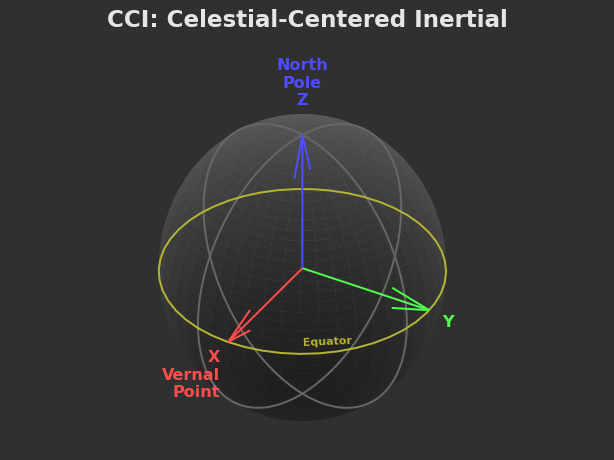
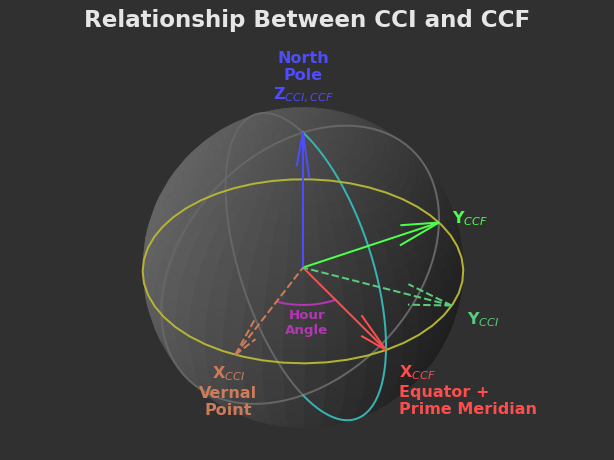

import { Aside } from "@astrojs/starlight/components";

If you're going to write a program that reads where your spacecraft is, or tells it which way to
point, there's one idea you can't get around: **space needs an agreed-upon way to describe "where"
and "which way."** That's all a _reference frame_ is. It sounds like heavy orbital-mechanics
vocabulary, but the actual concept is something you already use every day.

This page is intended to be the gentle version, no equations, no code... just some pictures that hopefully make things click. 
If you take one thing away, remember the frame called **CCI**, because that's the primary one you'll be using with your vessels!

If you want the full and probably more correct explanation you should read the excellent [Celestial Coordinate Frames](https://forums.ahwoo.com/threads/celestial-coordinate-frames-in-ksa.619/) KSA Forum post by developer gravhoek

## What a "frame" actually is

Imagine you tell a friend, _"the coffee shop is three blocks east of here."_ That sentence only works
because you both silently agreed on two things: **where "here" is**, and **which way "east" is.**
Change either one and the directions fall apart. Give the same instructions to someone standing in a
different city, or someone who thinks "east" is the other way, and they'll end up nowhere near the
coffee.

A reference frame is just those two agreements, written down and made precise:

- **an origin** — the one point everything is measured _from_ ("here"), and
- **three directions** — arrows we call X, Y, and Z that tell us which way is which.

That's the whole trick. Pick an origin and three arrows, and suddenly "where" and "which way" have
exact answers. Every frame you're about to meet is just a different choice of _where's the center_ and
_which way do the arrows point._

The three arrows always follow the same "handedness" so the math stays consistent — the classic
right-hand rule. Point your right hand's fingers along X, curl them toward Y, and your thumb points
along Z:

You don't need to memorize that. Just know that when you see X, Y, and Z on the pictures below,
they're a tidy little set of "which way" arrows, and they hang together like the fingers of one hand.

<Aside type="note" title="Diagram credit">
  The frame diagrams on this page come from the Kitten Space Agency developers' own write-up on how
  the game keeps track of positions and orientations. They're the clearest illustrations of these
  ideas around, so we're using them here with thanks.
</Aside>

## The whole-system map: ECL

Zoom all the way out to the entire star system. Where would you put the center? The obvious choice is
the star itself, sitting in the middle with all the planets looping around it. Flatten the arrows onto
the plane the planets roughly orbit in, and you get the **Ecliptic frame**, or **ECL**:

Think of ECL as the wall map of the solar system — great for questions like _"where is each planet
right now?"_ It's centered on the star, and it never spins or drifts, so it's a stable backdrop for
the whole system.

ECL is useful, but it's a bit like using a map of the entire country when all you want to do is park
the car. When you're actually flying a spacecraft near a planet, you want something more local.

## The one that matters: CCI

Here's the star of the show. Slide the origin off the star and plant it right at the center of **the
planet (or moon) you happen to be near**. Keep the arrows pinned to the distant stars so they never
rotate. That's **CCI** — _Celestial-Centered Inertial_:

Read the arrows off the picture:

- **Z** points straight up through the planet's **north pole**.
- **X** points at a fixed spot in the sky — the diagram calls it the _vernal point_, but you can
  think of it as _an arrow taped to the far wall of the universe._ It doesn't move.
- **Y** is just the third arrow that completes the set (that right-hand rule again).

The word doing the heavy lifting is **inertial** — a fancy way of saying **these arrows do not spin
with the planet.** The planet turns underneath, day and night roll by, but the X arrow keeps pointing
at that same distant spot in the sky. That stillness is exactly what makes CCI the sane place to do
anything involving motion: an orbit traced in CCI just sits there as a steady ring, instead of
smearing around as the world rotates.

**This is the frame gatOS hands you everything in.** When you read your ship's position, its velocity,
or which way its nose is pointing, the numbers are in CCI. When you tell the flight computer to point
somewhere, you're speaking CCI. Learn to picture this one and you're 90% of the way there.

### The one trick worth stealing

Because CCI's origin sits _at the planet's center_, the position numbers gatOS gives you have a lovely
hidden meaning: they're literally **the arrow that points from the planet's center out to your ship.**

Which leads to the single most useful shortcut in the whole system. Say you want to point your ship
_at_ the planet — straight down toward the surface. You could reach for trigonometry... or you could
notice that "toward the planet" is just "away from the planet, backwards." Your position is the arrow
_out_ to you; flip it around and you've got the arrow _back down_ to the planet. No math, just a minus
sign:

<svg
  viewBox="0 0 560 300"
  role="img"
  aria-labelledby="aim-t aim-d"
  style="max-width:520px;width:100%;height:auto;margin:1.5rem auto;display:block;"
>
  <title id="aim-t">Pointing at the planet is just your position, reversed</title>
  <desc id="aim-d">
    The planet sits at the center. Your position is the arrow from the center out to your ship. To
    aim back at the planet, flip that same arrow around — it's just the negative.
  </desc>
  <defs>
    <marker id="ah-pos" markerWidth="9" markerHeight="9" refX="7" refY="3" orient="auto">
      <path d="M0,0 L7,3 L0,6 Z" fill="#3b82f6" />
    </marker>
    <marker id="ah-aim" markerWidth="9" markerHeight="9" refX="7" refY="3" orient="auto">
      <path d="M0,0 L7,3 L0,6 Z" fill="#f97316" />
    </marker>
  </defs>
  <circle
    cx="150"
    cy="205"
    r="46"
    fill="currentColor"
    fill-opacity="0.12"
    stroke="currentColor"
    stroke-opacity="0.45"
  />
  <circle cx="150" cy="205" r="3.5" fill="currentColor" />
  <text x="150" y="278" text-anchor="middle" fill="currentColor" font-size="15" font-weight="600">
    planet center = the origin
  </text>
  <path d="M-9,7 L0,-11 L9,7 Z" fill="currentColor" transform="translate(430,68) rotate(20)" />
  <text x="430" y="42" text-anchor="middle" fill="currentColor" font-size="15" font-weight="600">
    your ship
  </text>
  <line
    x1="150"
    y1="205"
    x2="415"
    y2="82"
    stroke="#3b82f6"
    stroke-width="3"
    marker-end="url(#ah-pos)"
  />
  <text x="238" y="118" fill="#3b82f6" font-size="14.5" font-weight="700">
    position (planet → ship)
  </text>
  <line
    x1="448"
    y1="112"
    x2="192"
    y2="223"
    stroke="#f97316"
    stroke-width="3"
    stroke-dasharray="7 5"
    marker-end="url(#ah-aim)"
  />
  <text x="262" y="248" fill="#f97316" font-size="14.5" font-weight="700">
    aim = −position (ship → planet)
  </text>
</svg>

That "just negate the position" move is the entire idea behind the
[Point at parent](/gatOS/guides/vessel-control-point-at-parent/) tutorial. It only works because CCI is
centered on the planet — which is a pretty good advertisement for understanding your frames.

## CCI's confusing cousin: CCF

There's a second planet-centered frame, and mixing it up with CCI is the classic beginner trap, so
let's defuse it now. Same center (the planet's core), same up (Z through the north pole) — but this
one's X arrow is **bolted to the ground and spins with the planet.** It's called **CCF**,
_Celestial-Centered Fixed_, where "fixed" means _fixed to the planet's surface_:

In CCF the X arrow points at a specific place _on the planet_ (where the prime meridian crosses the
equator), so as the planet turns, X sweeps around with it like the hand of a clock. That makes CCF
perfect for questions about **spots on the surface** — latitude and longitude, where a launch pad is,
where a city sits. It makes CCF _terrible_ for orbits, because a steady orbit would appear to wobble
and drift as the ground spins beneath it.

The two frames share the same north pole, so the only difference is how far their X arrows have
drifted apart — and that gap is simply **how far the planet has rotated** since the two lined up. The
developers even gave that gap a name, the "hour angle," but you can just read it as _"the planet has
turned this much":_

<Aside type="tip" title="The easy way to remember it">
  **CCI** is pinned to the stars — it holds still while the planet spins inside it. Use it for
  **flying and orbits.** **CCF** is glued to the ground — it turns with the planet. Use it for
  **places on the surface.** Same center, same north pole; the difference is whether the sideways
  arrows spin.
</Aside>

## So which one do I use?

For almost everything you'll do in gatOS — reading where your ship is, checking how fast it's going,
and aiming it — the answer is **CCI, every time.** It's the frame behind the numbers you read and the
directions you write. Whenever a value or a control in gatOS mentions `cci`, now you know exactly what
it means: measured from the planet's center, against arrows that hold still while the world turns.

You'll bump into the surface frame (CCF) only when you're dealing with actual ground locations —
latitude and longitude are reported there. And there are a couple more specialized frames in the
family (one built around a single orbit's shape, another that keeps the ecliptic's tilt while centered
on a planet) that you can happily ignore until you go looking for them. If you ever want the full,
formal rundown, the developers document every frame in detail — but you don't need it to start flying.

That's the whole map. Origin plus three arrows; CCI for flying; CCF for the ground. With that in your
back pocket, head over to [Point at parent](/gatOS/guides/vessel-control-point-at-parent/) and put CCI to
work — you'll watch a ship swing around to face its planet using nothing but the "flip the arrow"
trick from up above.
