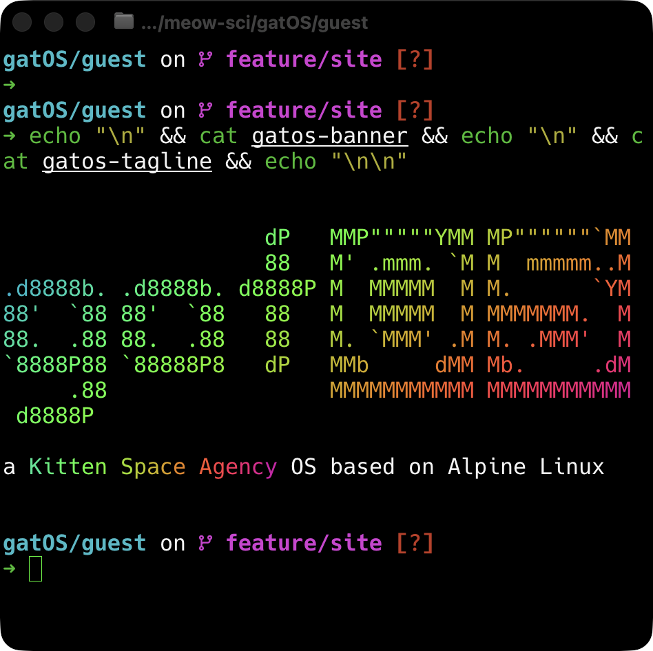

import { CardGrid, LinkButton, LinkCard } from "@astrojs/starlight/components";



Real Alpine Linux lives inside your KSA game. Open it through purrTTY, then read and control the
simulation through ordinary files under `/sim`. `cat` is a sensor. `echo` is a switch. Your rocket
now has a shell prompt, which is either a splendid idea or a terrible one. Probably both.

```sh
cat /sim/vessels/active/altitude/radar
echo 0.4 > /sim/vessels/active/ctl/throttle
```

<div class="hero-actions">
  <LinkButton href="/gatOS/intro/install/" icon="rocket">
    Install gatOS
  </LinkButton>
  <LinkButton href="/gatOS/intro/first-five-minutes/" variant="secondary">
    Take the first five minutes
  </LinkButton>
</div>

## Pick your hatch

<CardGrid>
  <LinkCard
    title="Open the onboard Linux"
    href="/gatOS/intro/first-five-minutes/"
    description="Explore /sim and fly something with ordinary shell tools."
  />
  <LinkCard
    title="Build automation and projects"
    href="/gatOS/guides/"
    description="Write flight programs, dashboards, timed shows, cameras, and a very serious soundboard."
  />
  <LinkCard
    title="Connect an AI agent"
    href="/gatOS/mcp/getting-started/"
    description="Use the concise local MCP API and a reliable observe–act–verify loop."
  />
</CardGrid>

## More than a terminal gag

gatOS has live vessel and celestial telemetry, atomic controls, HTTP, MQTT, serial, host mounts,
terminal video, camera tracks, audio playback, FX editors, cabin physics, welds, and a few bits of
excellent nonsense. Start with the [feature tour](/gatOS/intro/feature-tour/), then choose a guide
when you have a mission in mind.
